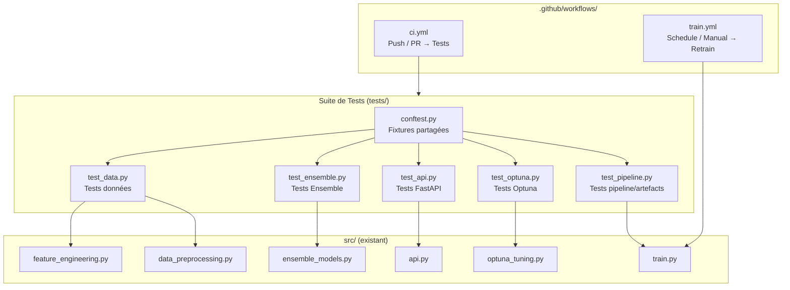

# Design Document — MLOps CI/CD & Tests Unitaires

## Overview

Ce document décrit l'architecture de test et le pipeline CI/CD pour finaliser le projet MLOps de prédiction du risque d'hospitalisation Medicare. Le projet est construit en Python avec FastAPI, XGBoost/LightGBM/CatBoost, Optuna et MLflow. Il manque actuellement la suite de tests (`tests/`) et les workflows GitHub Actions (`.github/workflows/`).

L'objectif est de :
1. Créer une suite de tests complète couvrant les modules `src/` avec pytest
2. Ajouter deux workflows GitHub Actions : CI (tests automatiques sur push/PR) et Train (réentraînement planifié ou manuel)
3. Garantir que l'API est testable sans dépendances aux fichiers de données réels (via mocking)

---

## Architecture



---

## Components and Interfaces

### 1. `tests/conftest.py` — Fixtures partagées

Point central de toutes les fixtures pytest. Toutes les dépendances externes (fichiers `.pkl`, `.csv`, `.json`) sont mockées ici.

**Fixtures principales :**

| Fixture | Type de retour | Description |
|---|---|---|
| `sample_patient_dict` | `dict` | Patient valide avec 28 features dans les plages Pydantic |
| `sample_dataframe` | `pd.DataFrame` | 100 lignes × 28 colonnes, valeurs numériques valides |
| `mock_model` | `DummyClassifier` | Modèle sklearn prêt à être utilisé dans les mocks |
| `mock_scaler` | `StandardScaler` | Scaler fitté sur des données synthétiques (11 colonnes numériques) |
| `mock_app` | `TestClient` | Client FastAPI avec joblib.load et pd.read_csv mockés |

**Liste des 28 features (ordre canonique, depuis `best_model_info.json`) :**
```python
FEATURE_NAMES = [
    "SP_ALZHDMTA", "SP_CHF", "SP_CHRNKIDN", "SP_CNCR", "SP_COPD",
    "SP_DEPRESSN", "SP_DIABETES", "SP_ISCHMCHT", "SP_OSTEOPRS",
    "SP_RA_OA", "SP_STRKETIA", "AGE", "SEXE_ENC", "RACE_ENC",
    "BENE_ESRD_IND", "GROUPE_AGE_ENC", "NB_COMORBIDITES",
    "CHARLSON_INDEX", "COUT_TOTAL", "IS_NEW_PATIENT",
    "NB_HOSP_PASSEES", "NB_OP_3M", "NB_OP_6M", "NB_OP_12M",
    "NB_CAR_6M", "NB_PRESCRIPTIONS", "NB_MOLECULES_UNIQUES",
    "POLYPHARMACIE"
]
```

**Stratégie de mocking pour l'API :**

L'API charge ses dépendances au **module level** (ligne `model = joblib.load(...)`) lors de l'import. Pour contourner cela, les tests utilisent `unittest.mock.patch` combiné avec `importlib.reload` ou, mieux, un `TestClient` construit après avoir patché `joblib.load` et `pd.read_csv` via `pytest-mock`.

```python
# Pattern recommandé dans conftest.py
@pytest.fixture
def mock_app(mock_model, mock_scaler):
    with patch("src.api.joblib.load") as mock_load, \
         patch("src.api.pd.read_csv") as mock_csv:
        mock_load.side_effect = [mock_model, mock_scaler]
        mock_csv.return_value = pd.DataFrame({"feature": FEATURE_NAMES})
        import importlib
        import src.api as api_module
        importlib.reload(api_module)
        yield TestClient(api_module.app)
```

---

### 2. `tests/test_data.py` — Tests données

Couvre `src/feature_engineering.py` et `src/data_preprocessing.py`.

**Fonctions testées :**
- `compute_charlson_index(row)` ou équivalent dans `feature_engineering.py`
- `safe_numeric(series, fill_value)` dans `data_preprocessing.py`
- Logique de split train/val/test (disjonction des ensembles)

---

### 3. `tests/test_ensemble.py` — Tests Ensemble

Couvre `src/ensemble_models.py`.

**Classe testée :** `ProbabilityAveragingEnsemble`

---

### 4. `tests/test_api.py` — Tests FastAPI

Couvre `src/api.py` avec le client FastAPI de test (`httpx` + `TestClient`).

**Dépendance :** `httpx` requis par `fastapi[testing]`

---

### 5. `tests/test_optuna.py` — Tests Optuna

Couvre `src/optuna_tuning.py`.

**Classe testée :** `OptunaTuner`

---

### 6. `tests/test_pipeline.py` — Tests pipeline / artefacts

Vérifie la cohérence des artefacts sauvegardés dans `models/` et `data/features/`. Ces tests sont des tests d'intégration légers qui nécessitent la présence des fichiers réels (skippés en CI si absents).

---

### 7. `.github/workflows/ci.yml` — Workflow CI

```yaml
# Déclencheurs : push sur main, pull_request vers main
# Runner : ubuntu-latest, Python 3.10
# Étapes :
#   1. Checkout code
#   2. Setup Python 3.10
#   3. Cache pip dependencies
#   4. pip install -r requirements.txt pytest pytest-cov httpx pytest-mock hypothesis
#   5. pytest tests/ --cov=src --cov-report=xml --ignore=tests/test_pipeline.py
#   6. Upload coverage.xml comme artifact (retention 7 jours)
```

Note : `test_pipeline.py` est exclu du CI car il nécessite les fichiers modèles réels.

---

### 8. `.github/workflows/train.yml` — Workflow Train

```yaml
# Déclencheurs : workflow_dispatch (manuel) + schedule cron "0 2 * * 1" (lundi 2h UTC)
# Runner : ubuntu-latest, Python 3.10
# Étapes :
#   1. Checkout code
#   2. Setup Python 3.10
#   3. pip install -r requirements.txt
#   4. python src/train.py (avec gestion d'erreur)
#   5. Si succès : upload models/*.pkl et models/*.json comme artifacts (retention 30j)
#   6. Afficher métriques depuis models/best_model_info.json dans le job summary
```

---

## Data Models

### PatientData (existant, `src/api.py`)

```python
class PatientData(BaseModel):
    AGE: float              # [0, 120]
    SEXE_ENC: int           # [0, 1]
    RACE_ENC: int           # [0, 5]
    BENE_ESRD_IND: int      # [0, 1]
    GROUPE_AGE_ENC: int     # [0, 3]
    SP_*: int               # 11 colonnes comorbidités [0, 1]
    NB_COMORBIDITES: float  # >= 0
    CHARLSON_INDEX: float   # >= 0
    COUT_TOTAL: float       # >= 0
    IS_NEW_PATIENT: int     # [0, 1]
    NB_HOSP_PASSEES: float  # >= 0
    NB_OP_3M/6M/12M: float  # >= 0
    NB_CAR_6M: float        # >= 0
    NB_PRESCRIPTIONS: float # >= 0
    NB_MOLECULES_UNIQUES: float  # >= 0
    POLYPHARMACIE: int      # [0, 1]
```

### CHARLSON_WEIGHTS (existant, `src/feature_engineering.py`)

```python
CHARLSON_WEIGHTS = {
    "SP_CHF": 1, "SP_DIABETES": 1, "SP_CHRNKIDN": 2,
    "SP_CNCR": 2, "SP_COPD": 1, "SP_STRKETIA": 2,
    "SP_ALZHDMTA": 1, "SP_DEPRESSN": 1, "SP_ISCHMCHT": 1,
    "SP_OSTEOPRS": 0, "SP_RA_OA": 1
}
```

### Structure YAML du workflow CI

```yaml
name: CI Tests
on:
  push:
    branches: [main]
  pull_request:
    branches: [main]
jobs:
  test:
    runs-on: ubuntu-latest
    steps:
      - uses: actions/checkout@v4
      - uses: actions/setup-python@v5
        with: { python-version: "3.10" }
      - run: pip install -r requirements.txt pytest pytest-cov httpx pytest-mock hypothesis
      - run: pytest tests/ --cov=src --cov-report=xml --ignore=tests/test_pipeline.py
      - uses: actions/upload-artifact@v4
        with:
          name: coverage-report
          path: coverage.xml
          retention-days: 7
```

---

## Correctness Properties

*A property is a characteristic or behavior that should hold true across all valid executions of a system — essentially, a formal statement about what the system should do. Properties serve as the bridge between human-readable specifications and machine-verifiable correctness guarantees.*

### Property 1: CHARLSON_INDEX est une somme pondérée exacte

*For any* vecteur binaire de comorbidités (valeurs 0 ou 1 pour chaque colonne SP_*), le CHARLSON_INDEX calculé par le pipeline doit être égal à la somme des poids de `CHARLSON_WEIGHTS` pour les colonnes ayant la valeur 1.

**Validates: Requirements 1.1**

---

### Property 2: NB_COMORBIDITES est un comptage exact de colonnes actives

*For any* vecteur binaire de comorbidités, NB_COMORBIDITES doit être égal au nombre de colonnes SP_* ayant la valeur 1, c'est-à-dire la somme du vecteur binaire.

**Validates: Requirements 1.2**

---

### Property 3: safe_numeric élimine toutes les valeurs invalides

*For any* série pandas contenant un mélange arbitraire de valeurs numériques valides, `float('inf')`, `float('-inf')`, et `NaN`, après application de `safe_numeric`, la série résultante ne doit contenir ni valeur infinie ni NaN, et les positions qui contenaient une valeur invalide doivent être remplacées par `fill_value`.

**Validates: Requirements 1.3**

---

### Property 4: Les splits train/val/test sont strictement disjoints

*For any* DataFrame de patients avec des identifiants uniques `DESYNPUF_ID`, après application de la logique de split, l'intersection de chaque paire de sous-ensembles (train ∩ val, train ∩ test, val ∩ test) doit être vide.

**Validates: Requirements 1.4**

---

### Property 5: predict_proba de l'Ensemble produit des probabilités normalisées

*For any* ensemble d'estimateurs (1 à N) et *for any* matrice d'entrée X, chaque ligne de la sortie de `ProbabilityAveragingEnsemble.predict_proba(X)` doit sommer à 1.0 (à ±1e-6 près), et toutes les valeurs doivent être dans [0, 1].

**Validates: Requirements 2.1, 2.2**

---

### Property 6: predict est cohérent avec predict_proba

*For any* ensemble d'estimateurs et *for any* matrice d'entrée X, `predict(X)[i]` doit toujours être égal à `classes_[argmax(predict_proba(X)[i])]`.

**Validates: Requirements 2.6**

---

### Property 7: La classification du risque est déterministe et correcte par rapport au seuil

*For any* valeur de probabilité p ∈ [0, 1] et seuil t ∈ (0, 1), la logique de classification doit satisfaire : si p >= t alors risque = "ÉLEVÉ", si p >= t*0.5 alors risque = "MODÉRÉ", sinon risque = "FAIBLE". Ces trois cas sont mutuellement exclusifs et couvrent [0, 1].

**Validates: Requirements 3.5, 3.6**

---

## Error Handling

### API (`src/api.py`)

| Erreur | Comportement actuel | Comportement attendu dans les tests |
|---|---|---|
| Champ hors plage Pydantic | HTTP 422 automatique | Vérifié par test_api.py (req 3.3) |
| Exception interne `predict` | HTTP 500 avec `detail` | Vérifié par test_api.py via mock d'exception |
| Fichiers modèles manquants | Exception au démarrage | Géré par mocking dans les tests CI |

### Ensemble (`src/ensemble_models.py`)

| Condition | Exception levée |
|---|---|
| Liste d'estimateurs vide | `ValueError` dans `predict_proba` |
| Longueur weights ≠ nb estimateurs | `ValueError` dans `_weights_array` |
| Weights tous négatifs | `ValueError` dans `_weights_array` |
| Weights somme = 0 | `ValueError` dans `_weights_array` |
| Estimateur sans `predict_proba` | `TypeError` |

### CI/CD

| Cas | Comportement |
|---|---|
| Test unitaire échoue | Exit code 1, merge bloqué |
| Train script échoue | Artefacts précédents conservés, exit code non-zéro |
| Upload artifact échoue | Exit code non-zéro retourné quand même |

---

## Testing Strategy

### Framework et librairies

| Outil | Version | Usage |
|---|---|---|
| `pytest` | >=7.0 | Framework de tests principal |
| `pytest-cov` | >=4.0 | Couverture de code → `coverage.xml` |
| `httpx` | >=0.24 | Client HTTP pour FastAPI TestClient |
| `pytest-mock` | >=3.10 | Mocking via fixture `mocker` |
| `hypothesis` | >=6.80 | Property-based testing |

### Approche duale : tests exemples + tests propriétés

- **Tests exemples** : endpoints `/health`, `/model/info`, cas d'erreur spécifiques (AGE invalide, ensemble vide), chargement des artefacts JSON
- **Tests propriétés** : CHARLSON_INDEX, NB_COMORBIDITES, safe_numeric, disjointure des splits, normalisation Ensemble, cohérence predict/predict_proba, classification risque

### Property-Based Testing avec Hypothesis

Chaque propriété est implémentée avec un seul test Hypothesis configuré avec **minimum 100 itérations**.

**Format des tags :**
```python
@given(...)
@settings(max_examples=100)
# Feature: mlops-cicd, Property N: [description]
def test_property_name(...):
    ...
```

**Générateurs utilisés :**
- `hypothesis.strategies.lists(st.integers(0, 1), min_size=11, max_size=11)` → vecteurs binaires SP_*
- `hypothesis.strategies.floats(allow_nan=True, allow_infinity=True)` → valeurs safe_numeric
- `hypothesis.strategies.integers(min_value=1, max_value=5)` → nombre d'estimateurs

### Organisation des tests

```
tests/
├── conftest.py          # Fixtures + mocks partagés
├── test_data.py         # Properties 1, 2, 3, 4 + exemple 1.5
├── test_ensemble.py     # Properties 5, 6 + exemples 2.3, 2.4, 2.5
├── test_api.py          # Property 7 + exemples 3.1, 3.3, 3.4
├── test_optuna.py       # Exemples 4.1, 4.2, 4.3
└── test_pipeline.py     # Intégration/smoke 5.1–5.4 (skippé en CI)
```

### Couverture cible

- `src/ensemble_models.py` : 95%+
- `src/feature_engineering.py` (fonctions CHARLSON/comorbidités) : 90%+
- `src/api.py` (hors chargement au module level) : 85%+
- `src/data_preprocessing.py` (`safe_numeric`, `require_file`) : 90%+
- `src/optuna_tuning.py` : 70%+ (limité par le coût des vrais runs)

### Tests exclus du CI

`test_pipeline.py` est exclu du CI avec `--ignore=tests/test_pipeline.py` car il charge les fichiers `.pkl` et `.parquet` réels qui ne sont pas présents dans le runner GitHub. Ces tests s'exécutent localement.
